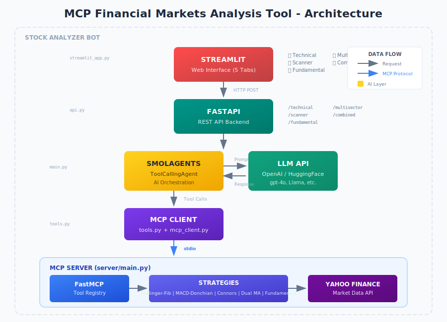
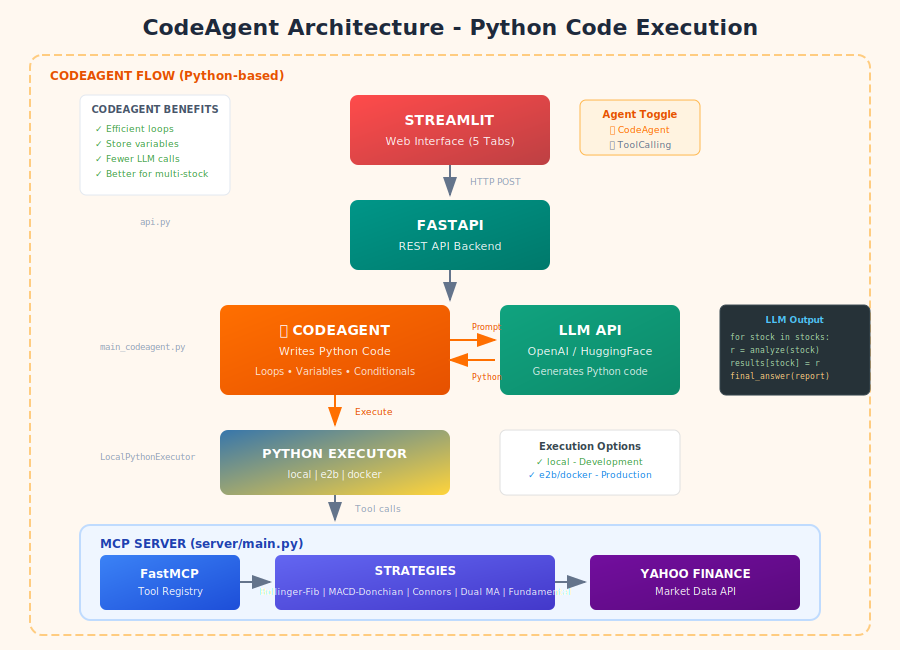

# 📊 Herramienta de Análisis de Mercados Financieros MCP

Una plataforma de análisis financiero impulsada por IA que combina **Model Context Protocol (MCP)**, **smolagents**, **FastAPI** y **Streamlit** para ofrecer informes de análisis de inversión de nivel profesional. El sistema utiliza Modelos de Lenguaje de Gran Escala para orquestar herramientas de estrategias de trading e interpretar datos financieros, transformando datos de mercado en bruto en información accionable para inversiones.

<p align="center">
  
  
  
  
  
</p>

---

## 🎯 Descripción General

Esta aplicación proporciona **5 tipos distintos de análisis** a través de una interfaz web moderna:

| Tipo de Análisis | Descripción | Caso de Uso |
|------------------|-------------|-------------|
| **📈 Análisis Técnico** | 4 estrategias de trading en una sola acción | Análisis profundo de patrones de precios |
| **🔍 Escáner de Mercado** | Compara múltiples acciones simultáneamente | Encuentra las mejores oportunidades |
| **📊 Análisis Fundamental** | Interpretación de estados financieros | Evalúa la salud de la empresa |
| **🌐 Análisis Multi-Sector** | Comparación entre sectores | Diversificación de cartera |
| **🔄 Análisis Combinado** | Técnico + Fundamental juntos | Tesis de inversión completa |

### ¿Qué Hace que Esto Sea Diferente?

A diferencia de las herramientas de análisis tradicionales que solo muestran números, este sistema usa **IA para interpretar** los datos:

```
Herramienta Tradicional: "RSI = 28.5, MACD = -2.3, P/E = 15.2"

Esta Aplicación: "AAPL muestra condiciones de sobreventa con RSI en 28.5, 
                   sugiriendo una potencial oportunidad de reversión a la media. 
                   Combinado con fundamentos sólidos (P/E de 15.2 por debajo del 
                   promedio del sector), esto presenta una señal de COMPRA con 
                   alta convicción..."
```

---

## 🤖 Dos Arquitecturas de Agentes

Esta aplicación soporta **dos tipos diferentes de agentes de IA**, cada uno con ventajas distintas:

### 🔧 ToolCallingAgent (Original)

El enfoque tradicional donde el LLM genera JSON para llamar herramientas una a la vez.

<p align="center">
  
</p>

### 🐍 CodeAgent (Nuevo - Recomendado)

El enfoque avanzado donde el LLM escribe código Python para llamar herramientas, permitiendo loops y variables.

<p align="center">
  
</p>

---

## ⚖️ Comparación de Agentes: ToolCallingAgent vs CodeAgent

### Cómo Funcionan

| Aspecto | 🔧 ToolCallingAgent | 🐍 CodeAgent |
|---------|---------------------|--------------|
| **Formato de Salida** | Llamadas JSON a herramientas | Código Python |
| **Invocación de Herramientas** | `{"tool": "analyze", "args": {...}}` | `result = analyze(symbol="AAPL")` |
| **Multi-herramienta** | Una llamada por ronda LLM | Puede hacer batch con loops |
| **Variables** | ❌ No puede almacenar resultados | ✅ Puede usar variables |
| **Loops** | ❌ No soportado | ✅ `for stock in stocks:` |
| **Condicionales** | ❌ No soportado | ✅ `if signal == "BUY":` |

### Ejemplo: Analizando 5 Acciones

**Enfoque ToolCallingAgent:**
```
Ronda 1: LLM → "Llamar analyze(AAPL)" → Resultado
Ronda 2: LLM → "Llamar analyze(MSFT)" → Resultado  
Ronda 3: LLM → "Llamar analyze(GOOGL)" → Resultado
Ronda 4: LLM → "Llamar analyze(META)" → Resultado
Ronda 5: LLM → "Llamar analyze(NVDA)" → Resultado
Ronda 6: LLM → Sintetizar todos los resultados → Informe

Total: 6 llamadas LLM
```

**Enfoque CodeAgent:**
```python
# LLM genera este código en UNA ronda:
results = {}
for stock in ["AAPL", "MSFT", "GOOGL", "META", "NVDA"]:
    results[stock] = analyze(symbol=stock, period="1y")

# Calcular consenso
buy_signals = sum(1 for r in results.values() if "BUY" in r)
report = f"Consenso: {buy_signals}/5 acciones muestran señales COMPRA..."

final_answer(report)

Total: 1-2 llamadas LLM
```

### Comparación de Rendimiento

| Escenario | ToolCallingAgent | CodeAgent | Mejora |
|-----------|-----------------|-----------|--------|
| 1 acción, 4 herramientas | ~45 segundos | ~40 segundos | ~10% más rápido |
| 5 acciones, 4 herramientas cada una | ~3 minutos | ~1.5 minutos | ~50% más rápido |
| 3 sectores, 30 acciones | ~15 minutos | ~5 minutos | ~66% más rápido |

### Pros y Contras

#### 🔧 ToolCallingAgent

| ✅ Pros | ❌ Contras |
|---------|-----------|
| Simple y predecible | Una llamada de herramienta por ronda LLM |
| Sin riesgos de ejecución de código | Más llamadas API LLM = mayor costo |
| Más fácil de depurar | Más lento para análisis multi-acción |
| Funciona con cualquier LLM | No puede componer lógica compleja |
| Enfoque probado | Limitado a ejecución secuencial |

**Mejor Para:**
- Análisis de acción única
- Consultas simples
- Ambientes de producción con seguridad estricta
- LLMs con generación de código débil

#### 🐍 CodeAgent

| ✅ Pros | ❌ Contras |
|---------|-----------|
| Loops eficientes para multi-acción | Requiere sandbox de ejecución de código |
| Menos llamadas LLM = menor costo | Más complejo de depurar |
| Puede almacenar y reusar resultados | Necesita LLM con buenas habilidades Python |
| Razonamiento natural basado en código | Consideraciones de seguridad |
| Mejor para análisis complejos | Puede generar código inválido |

**Mejor Para:**
- Escaneo multi-acción
- Análisis multi-sector
- Análisis comparativo complejo
- Ambientes de desarrollo
- Uso consciente de costos

### Consideraciones de Seguridad

| Ejecutor | Nivel de Seguridad | Caso de Uso |
|----------|-------------------|-------------|
| `local` | ⚠️ Bajo | Solo desarrollo |
| `e2b` | ✅ Alto | Producción (sandbox cloud) |
| `docker` | ✅ Alto | Producción (auto-hospedado) |

```python
# Desarrollo (ejecución local)
agent = CodeAgent(tools=tools, model=model, executor_type="local")

# Producción (sandbox E2B)
agent = CodeAgent(tools=tools, model=model, executor_type="e2b")

# Producción (sandbox Docker)
agent = CodeAgent(tools=tools, model=model, executor_type="docker")
```

### Cuándo Usar Cuál

```
┌─────────────────────────────────────────────────────────────────┐
│                  DIAGRAMA DE DECISIÓN                           │
├─────────────────────────────────────────────────────────────────┤
│                                                                 │
│  ¿Analizando acción única?                                      │
│      │                                                          │
│      ├── SÍ → Cualquier agente funciona bien                    │
│      │                                                          │
│      └── NO (múltiples acciones)                                │
│              │                                                  │
│              └── Usar CodeAgent (2-3x más rápido)               │
│                                                                 │
│  ¿Ambiente de producción?                                      │
│      │                                                          │
│      ├── SÍ + Seguridad crítica → ToolCallingAgent              │
│      │                                                          │
│      ├── SÍ + Rendimiento crítico → CodeAgent + e2b/docker      │
│      │                                                          │
│      └── NO (desarrollo) → CodeAgent + local                    │
│                                                                 │
│  ¿LLM tiene habilidades Python débiles?                        │
│      │                                                          │
│      └── SÍ → ToolCallingAgent (más confiable)                  │
│                                                                 │
└─────────────────────────────────────────────────────────────────┘
```

---

## 🏗️ Descripción General de la Arquitectura

**Resumen del Flujo de Datos:**

Ambos tipos de agentes siguen el mismo flujo de alto nivel:

1. **Streamlit** → El usuario interactúa con la interfaz web
2. **FastAPI** → La API REST recibe solicitudes, selecciona el tipo de agente
3. **Agent** → ToolCallingAgent O CodeAgent procesa la solicitud
4. **LLM API** → OpenAI/HuggingFace guía la selección de herramientas
5. **MCP Client** → Conecta el agente al servidor MCP
6. **MCP Server** → Ejecuta herramientas de análisis financiero
7. **Strategies** → Calcula indicadores técnicos
8. **Yahoo Finance** → Proporciona datos de mercado

### Estructura de Carpetas

```
mcp_financial_markets_analysis_tool/
│
├── server/                          # MCP Server (Herramientas Financieras)
│   ├── main.py                      # Punto de entrada del servidor
│   ├── strategies/                  # Implementaciones de estrategias de trading
│   │   ├── bollinger_fibonacci.py   # Bollinger + Fibonacci
│   │   ├── macd_donchian.py         # MACD + Donchian Channel
│   │   ├── connors_zscore.py        # Connors RSI + Z-Score
│   │   ├── dual_moving_average.py   # Cruce 50/200 EMA
│   │   ├── bollinger_zscore.py      # Bollinger + Z-Score
│   │   ├── fundamental_analysis.py  # Estados Financieros
│   │   ├── performance_tools.py     # Herramientas de Backtesting
│   │   └── unified_market_scanner.py# Escáner Multi-Acción
│   ├── utils/
│   │   └── yahoo_finance_tools.py   # Descarga de Datos y Cálculo de Indicadores
│   └── README.md                    # 📚 Documentación Detallada del Servidor
│
├── stock_analyzer_bot/              # Smolagents Bot (Orquestación de IA)
│   ├── __init__.py
│   ├── main.py                      # Implementación ToolCallingAgent
│   ├── main_codeagent.py            # Implementación CodeAgent (NUEVO)
│   ├── api.py                       # Endpoints REST de FastAPI
│   ├── tools.py                     # Wrappers de herramientas Smolagents
│   ├── mcp_client.py                # Gestor de conexión MCP
│   └── README.md                    # 📚 Documentación Detallada del Bot
│
├── docs/
│   ├── architecture.svg             # Diagrama ToolCallingAgent
│   ├── architecture_codeagent.svg   # Diagrama CodeAgent (NUEVO)
│   └── SECTORS_REFERENCE.md         # Referencia de símbolos de sectores
│
├── streamlit_app.py                 # Interfaz Web (5 Pestañas de Análisis)
├── .env                             # Variables de entorno
├── requirements.txt                 # Dependencias de Python
└── README.md                        # 📚 Este archivo
```

---

## 🤖 Entendiendo Smolagents

### ¿Qué es Smolagents?

[**Smolagents**](https://huggingface.co/docs/smolagents/index) es una biblioteca Python de código abierto de Hugging Face que facilita la construcción de agentes de IA que pueden usar herramientas.

> *"smolagents está diseñado para hacer extremadamente fácil construir y ejecutar agentes usando solo unas pocas líneas de código."* - HuggingFace

### Por Qué se Recomienda CodeAgent

Según [investigación de HuggingFace](https://huggingface.co/docs/smolagents/tutorials/secure_code_execution):

> *"Múltiples estudios de investigación han demostrado que hacer que el LLM escriba sus acciones en código es mucho mejor que el formato estándar actual para llamadas de herramientas, que son diferentes variantes de escribir acciones como JSON."*

**El código es mejor porque:**
- **Composabilidad**: Anidar funciones, usar loops, crear lógica reutilizable
- **Gestión de Objetos**: Almacenar salidas en variables para uso posterior
- **Generalidad**: Expresar cualquier cálculo, no solo llamadas de herramientas
- **Datos de Entrenamiento**: Los LLMs han visto mucho código Python en entrenamiento

[**Smolagents**](https://huggingface.co/docs/smolagents/index) es una biblioteca Python de código abierto de Hugging Face que facilita la construcción de agentes de IA que pueden usar herramientas. Es el "cerebro" de nuestra aplicación.

> *"smolagents está diseñado para hacer extremadamente fácil construir y ejecutar agentes usando solo unas pocas líneas de código."* - HuggingFace

### Características Clave de Smolagents que Usamos

| Característica | Cómo la Usamos |
|----------------|----------------|
| **ToolCallingAgent** | Orquesta llamadas a nuestras 7 herramientas financieras |
| **LiteLLMModel** | Conecta con OpenAI (gpt-4o, gpt-4-turbo) |
| **InferenceClientModel** | Conecta con modelos de HuggingFace |
| **@tool decorator** | Envuelve nuestras herramientas MCP para uso del agente |
| **Multi-step reasoning** | El agente decide qué herramientas llamar y en qué orden |

### Cómo Funciona Smolagents en Nuestra Aplicación

```python
# 1. Definir herramientas que el agente puede usar
from smolagents import tool

@tool
def bollinger_fibonacci_analysis(symbol: str, period: str = "1y") -> str:
    """Analiza una acción usando Bandas de Bollinger + retroceso de Fibonacci."""
    # Llama al servidor MCP, retorna datos de análisis
    return _call_mcp_tool("analyze_bollinger_fibonacci_performance", {...})

# 2. Crear un agente con el LLM y las herramientas
from smolagents import ToolCallingAgent, LiteLLMModel

model = LiteLLMModel(model_id="gpt-4o")
agent = ToolCallingAgent(
    tools=[bollinger_fibonacci_analysis, macd_donchian_analysis, ...],
    model=model,
    max_steps=25,
)

# 3. Ejecutar el agente con un prompt
report = agent.run("""
    Analiza la acción AAPL usando las 4 estrategias técnicas.
    Crea un informe markdown completo con recomendaciones.
""")
```

### Proceso de Decisión del Agente

Cuando solicitas un análisis, el agente:

```
1. LEE el prompt: "Analiza AAPL con 4 estrategias"
   
2. PLANIFICA: "Necesito llamar 4 herramientas: bollinger_fibonacci, macd_donchian, 
               connors_zscore, dual_moving_average"
   
3. EJECUTA: Llama cada herramienta, recibe datos
   
4. SINTETIZA: Combina todos los resultados, identifica patrones
   
5. GENERA: Crea informe markdown profesional con recomendación
```

Por eso los resultados están **interpretados**, no solo mostrados.

---

## 📱 Interfaz Streamlit

### Selector de Tipo de Agente

La barra lateral ahora incluye un selector de tipo de agente:

```
┌─────────────────────────────────────┐
│  ⚙️ Configuración                   │
│                                     │
│  🤖 Tipo de Agente                  │
│  ○ 🔧 ToolCallingAgent (Original)   │
│  ● 🐍 CodeAgent (Nuevo - Más Rápido)│
│                                     │
│  Ejecutor de Código: [local ▼]      │
│                                     │
└─────────────────────────────────────┘
```

### 5 Tipos de Análisis

| Pestaña | Descripción | Agente Recomendado |
|---------|-------------|-------------------|
| 📈 Técnico | Acción única, 4 estrategias | Cualquiera |
| 🔍 Escáner | Comparación multi-acción | 🐍 CodeAgent |
| 📊 Fundamental | Estados financieros | Cualquiera |
| 🌐 Multi-Sector | Análisis entre sectores | 🐍 CodeAgent |
| 🔄 Combinado | Téc + Fundamental | Cualquiera |

**Propósito:** Análisis profundo de una sola acción usando 4 estrategias de trading

**Qué Hace:**
- Llama 4 herramientas de estrategia para una acción
- Cada estrategia proporciona: señal, puntaje, % de retorno, ratio de Sharpe, caída máxima
- La IA sintetiza en un informe cohesivo con recomendación

**Estrategias Utilizadas:**
1. **Bollinger-Fibonacci** - Soporte/resistencia con bandas de volatilidad
2. **MACD-Donchian** - Momentum con detección de breakouts
3. **Connors RSI + Z-Score** - Señales de reversión a la media
4. **Dual Moving Average** - Seguimiento de tendencia (Golden/Death Cross)

**Mejor Para:** "¿Debería comprar/vender/mantener esta acción específica?"

---

### Pestaña 2: 🔍 Escáner de Mercado

**Propósito:** Comparar múltiples acciones y clasificar oportunidades

**Qué Hace:**
- Ejecuta las 4 estrategias en cada acción de tu lista
- Compara el rendimiento entre acciones
- Clasifica de mejor a peor oportunidad
- Identifica selecciones de consenso

**Entrada de Ejemplo:** `AAPL, MSFT, GOOGL, META, NVDA, AMD`

**Mejor Para:** "¿Cuál acción en este grupo es la mejor oportunidad?"

---

### Pestaña 3: 📊 Análisis Fundamental

**Propósito:** Analizar la salud financiera de la empresa desde sus estados financieros

**Qué Hace:**
- Recupera estado de resultados, balance general, flujo de caja
- Calcula ratios clave: P/E, ROE, deuda-capital, márgenes
- La IA interpreta la salud financiera
- Crea tesis de inversión

**Métricas Analizadas:**
- **Rentabilidad:** Ingresos, Ingreso Neto, Márgenes
- **Crecimiento:** Crecimiento de ingresos, crecimiento de ganancias
- **Liquidez:** Ratio corriente, ratio rápido
- **Apalancamiento:** Ratios de deuda, cobertura de intereses
- **Retornos:** ROE, ROA

**Mejor Para:** "¿Esta empresa es financieramente saludable?"

---

### Pestaña 4: 🌐 Análisis Multi-Sector

**Propósito:** Comparar acciones a través de diferentes sectores del mercado

**Qué Hace:**
- Analiza múltiples sectores (Banca, Tecnología, Energía Limpia, etc.)
- Ejecuta 4 estrategias en cada acción de cada sector
- Compara el rendimiento ENTRE sectores
- Identifica las mejores oportunidades de todo el universo

**Sectores Predeterminados:**
```
Banca: JPM, BAC, WFC, C, GS, MS, USB, PNC, TFC, COF
Tecnología: AAPL, MSFT, GOOGL, META, NVDA, AMD, CRM, ORCL, ADBE, INTC
Energía Limpia: TSLA, NIO, RIVN, LCID, PLUG, SEDG, NEE, ICLN, ENPH
```

**Mejor Para:** "¿Dónde debería invertir en todo el mercado?"

⚠️ **Nota:** Esto es computacionalmente intensivo (120+ llamadas de herramientas para 3 sectores × 10 acciones)

---

### Pestaña 5: 🔄 Análisis Combinado

**Propósito:** Fusionar análisis Técnico y Fundamental para una imagen completa

**Filosofía:**
- **Análisis Fundamental** = "QUÉ comprar" (calidad de la empresa)
- **Análisis Técnico** = "CUÁNDO comprar" (timing)
- **Combinado** = Vista de inversión de 360 grados

**Alineación de Señales:**
| Señal FA | Señal AT | Interpretación |
|----------|----------|----------------|
| Alcista | Alcista | ✅ Alta convicción COMPRAR |
| Alcista | Bajista | ⚠️ Buena empresa, mal timing - ESPERAR |
| Bajista | Alcista | ⚠️ Rebote técnico, fundamentos débiles - PRECAUCIÓN |
| Bajista | Bajista | ❌ Alta convicción EVITAR |

**Mejor Para:** "Dame la imagen completa de inversión"

---

## 🚀 Inicio Rápido

### Prerrequisitos

- Python 3.10+
- Clave de API de OpenAI (recomendado) o token de HuggingFace
- Conexión a internet (datos de Yahoo Finance)

### Instalación

```bash
# Clonar el repositorio
git clone <repository-url>
cd mcp_financial_markets_analysis_tool

# Crear entorno virtual
python -m venv venv
source venv/bin/activate  # Linux/Mac
# o
.\venv\Scripts\activate   # Windows

# Instalar dependencias
pip install -r requirements.txt
```

### Configuración del Entorno

Crear un archivo `.env` en la raíz del proyecto:

```bash
# Requerido - Clave API LLM (elegir una)
OPENAI_API_KEY=sk-tu-clave-openai-aqui
# O
HF_TOKEN=hf_tu-token-huggingface

# Configuración del Modelo
SMOLAGENT_MODEL_ID=gpt-4o           # Recomendado para CodeAgent
SMOLAGENT_MODEL_PROVIDER=litellm     # litellm o inference

# Configuración del Agente (NUEVO)
SMOLAGENT_AGENT_TYPE=code_agent      # tool_calling o code_agent
SMOLAGENT_EXECUTOR=local             # local, e2b, o docker
SMOLAGENT_MAX_STEPS=25               # Pasos máximos de razonamiento

# Opcional - Valores Predeterminados
DEFAULT_ANALYSIS_PERIOD=1y
DEFAULT_SCANNER_SYMBOLS=AAPL,MSFT,GOOGL,AMZN
```

### Ejecutar la Aplicación

```bash
# Terminal 1: Iniciar el backend FastAPI
uvicorn stock_analyzer_bot.api:app --reload --port 8000

# Terminal 2: Iniciar el frontend Streamlit
streamlit run streamlit_app.py
```

Abrir el navegador en `http://localhost:8501`

---

## 🔧 Componentes Principales

### 1. MCP Server (`server/`)

El **Model Context Protocol Server** proporciona todas las herramientas de análisis financiero. Es un proceso independiente al que el bot se conecta vía stdio.

**Características Clave:**
- 5 estrategias de análisis técnico
- Backtesting de rendimiento con métricas
- Análisis fundamental desde estados financieros
- Escáner de mercado multi-acción

📚 **Documentación Detallada:** [server/README.md](server/README.md)

### 2. Stock Analyzer Bot (`stock_analyzer_bot/`)

La **capa de orquestación impulsada por smolagents** con soporte dual de agentes.

**Archivos Clave:**
- `main.py` - Implementación ToolCallingAgent
- `main_codeagent.py` - Implementación CodeAgent
- `api.py` - Endpoints FastAPI con selección de agente
- `tools.py` - Wrappers de herramientas MCP

📚 **Documentación Detallada:** [stock_analyzer_bot/README.md](stock_analyzer_bot/README.md)

### 3. Frontend Streamlit (`streamlit_app.py`)

La **interfaz web** con alternancia de agente y 5 pestañas de análisis.

---

## 📡 Referencia de API

### Selección de Agente

Todos los endpoints ahora aceptan el parámetro `agent_type`:

```json
{
  "symbol": "AAPL",
  "period": "1y",
  "agent_type": "code_agent",
  "executor_type": "local"
}
```

### Endpoints Disponibles

| Endpoint | Método | Descripción |
|----------|--------|-------------|
| `/health` | GET | Verificación de salud, muestra agentes disponibles |
| `/technical` | POST | Acción única, 4 estrategias |
| `/scanner` | POST | Comparación multi-acción |
| `/fundamental` | POST | Análisis de estados financieros |
| `/multisector` | POST | Análisis entre sectores |
| `/combined` | POST | Técnico + Fundamental |

### Formato de Respuesta

```json
{
  "report": "# Análisis Técnico Completo de AAPL\n...",
  "symbol": "AAPL",
  "analysis_type": "technical",
  "duration_seconds": 35.2,
  "agent_type": "code_agent"
}
```

---

## ⚙️ Configuración

### Modelos LLM Soportados

| Proveedor | Model ID | Soporte CodeAgent |
|-----------|----------|-------------------|
| OpenAI | `gpt-4o` | ✅ Excelente |
| OpenAI | `gpt-4o-mini` | ✅ Bueno |
| OpenAI | `gpt-4-turbo` | ✅ Excelente |
| HuggingFace | `meta-llama/Llama-3.1-70B-Instruct` | ⚠️ Variable |

**Nota:** CodeAgent funciona mejor con modelos que tienen fuertes habilidades de generación de código Python. Se recomienda GPT-4o.

### Períodos de Análisis

Períodos válidos: `1d`, `5d`, `1mo`, `3mo`, `6mo`, `1y`, `2y`, `5y`, `10y`, `ytd`, `max`

---

## 🧪 Probando Ambos Agentes

### Comparación Rápida

```bash
# Probar ambos agentes en la misma acción
python test_codeagent.py AAPL

# Probar en escáner de mercado
python test_codeagent.py AAPL --mode scanner --symbols "AAPL,MSFT,GOOGL"
```

### En Streamlit

1. Ejecutar Análisis Técnico con **ToolCallingAgent**
2. Anotar la duración en Historial
3. Cambiar a **CodeAgent** en la barra lateral
4. Ejecutar el mismo análisis
5. Comparar tiempos

### Parámetros de Estrategia

| Estrategia | Parámetros Clave |
|------------|------------------|
| Bollinger-Fibonacci | window=20, num_std=2 |
| MACD-Donchian | fast=12, slow=26, signal=9 |
| Connors RSI | rsi_period=3, streak=2, rank=100 |
| Dual MA | short=50, long=200, type=EMA |

---

## 🧪 Ejemplos de Informes

### Estructura del Informe de Análisis Técnico

```markdown
# Análisis Técnico Completo de AAPL
*Fecha de Análisis: 2024-01-15*
*Precio Actual: $185.92*

## Resumen Ejecutivo
[2-3 párrafos sintetizando todos los hallazgos de las estrategias]

## Comparación de Rendimiento de Estrategias
| Estrategia | Señal | Puntaje | Retorno | Sharpe | DD Máx |
|------------|-------|---------|---------|--------|--------|
| Bollinger-Fib | COMPRA | +45 | 12.3% | 1.2 | -8.5% |
| MACD-Donchian | MANTENER | +15 | 8.1% | 0.9 | -12.1% |
| ... | ... | ... | ... | ... | ... |

## Análisis Individual de Estrategias
[Desglose detallado de cada estrategia]

## Evaluación de Riesgo
[Análisis de volatilidad y caída]

## Recomendación Final: **COMPRAR**
[Razonamiento de apoyo]
```

---

## 🔒 Seguridad y Descargos de Responsabilidad

### Seguridad de Ejecución de Código

Cuando se usa CodeAgent:
- **Desarrollo**: El ejecutor `local` está bien
- **Producción**: Usar `e2b` o `docker` para ejecución en sandbox
- Nunca ejecutar código no confiable en ejecutor local

### Seguridad de Claves API

- Nunca envíes archivos `.env` al control de versiones
- Usa variables de entorno para todos los datos sensibles
- Las claves API nunca se registran ni almacenan

### Descargo de Responsabilidad Financiera

⚠️ **IMPORTANTE:** Este software es solo para **fines educativos e investigación**.

- Todos los resultados de análisis deben ser verificados independientemente
- El rendimiento pasado no garantiza resultados futuros
- Esto NO es asesoría financiera
- Consulta un asesor financiero licenciado antes de invertir

---

## 🛠️ Solución de Problemas

| Problema | Solución |
|----------|----------|
| "CodeAgent not available" | Asegúrate de que `main_codeagent.py` existe en `stock_analyzer_bot/` |
| "Code execution failed" | Verifica sintaxis Python en salida LLM, prueba diferente modelo |
| "MCP server not found" | Verifica que `server/main.py` existe en la raíz del proyecto |
| "Timeout" | Reduce acciones o aumenta timeout; usa CodeAgent para multi-acción |
| "Agent stopped early" | Aumenta el parámetro `max_steps` |

---

## 📚 Documentación Adicional

| Documento | Descripción |
|-----------|-------------|
| [server/README.md](server/README.md) | Herramientas del MCP Server, estrategias, parámetros |
| [stock_analyzer_bot/README.md](stock_analyzer_bot/README.md) | Implementaciones de agentes, endpoints API |
| [docs/SECTORS_REFERENCE.md](docs/SECTORS_REFERENCE.md) | Símbolos de sectores y configuración |
| [HuggingFace Smolagents](https://huggingface.co/docs/smolagents/index) | Documentación oficial de smolagents |
| [Secure Code Execution](https://huggingface.co/docs/smolagents/tutorials/secure_code_execution) | Guía de seguridad de CodeAgent |

---

## 🤝 Contribuir

1. Haz fork del repositorio
2. Crea una rama de característica
3. Implementa tus cambios
4. Agrega pruebas si aplica
5. Envía un pull request

### Agregar Nuevos Tipos de Agentes

La arquitectura soporta agregar nuevos tipos de agentes:

1. Crear nuevo módulo en `stock_analyzer_bot/`
2. Implementar las mismas firmas de función que `main.py`
3. Registrar en `api.py` con nueva opción de tipo de agente
4. Actualizar UI en `streamlit_app.py`

---

## 📄 Licencia

Este proyecto se proporciona para fines educativos. Los usuarios deben cumplir con:
- Términos de Servicio de Yahoo Finance
- Términos de Servicio de OpenAI / HuggingFace
- Regulaciones financieras locales aplicables

---

## 🙏 Agradecimientos

- [Smolagents](https://huggingface.co/docs/smolagents/index) por Hugging Face
- [FastMCP](https://github.com/jlowin/fastmcp) por el framework MCP
- [yfinance](https://github.com/ranaroussi/yfinance) por los datos de mercado
- [FastAPI](https://fastapi.tiangolo.com/) por la API REST
- [Streamlit](https://streamlit.io/) por la interfaz web

---

<p align="center">
  <b>Construido con ❤️ usando smolagents, MCP, FastAPI y Streamlit</b><br>
  <i>Ahora con soporte dual de agentes: ToolCallingAgent y CodeAgent</i>
</p>
